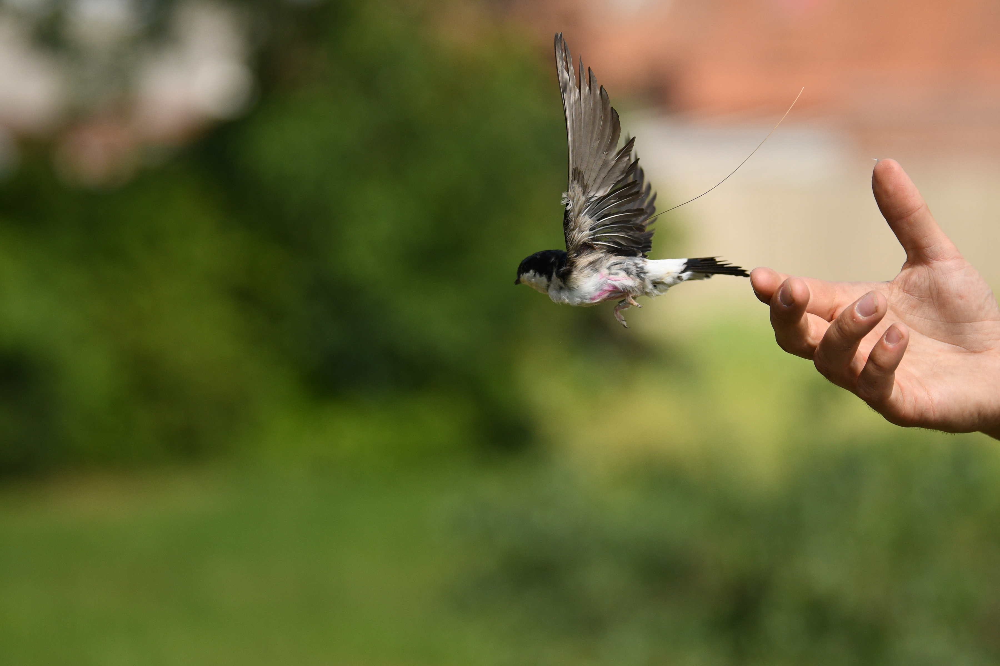

# Sick without signs. Subclinical infections reduce local movements, alter habitat selection, and cause demographic shifts

Doi: <https://doi.org/10.1038/s42003-024-07114-4>

Zenodo repository: <https://doi.org/10.5281/zenodo.13934755>

# Abstract

In wildlife populations, parasites often go unnoticed,
as infected animals appear asymptomatic. However, these infections can subtly
alter behaviour. Field evidence of how these subclinical infections induce
changes in movement behaviour is scarce in free-ranging animals, yet it may be
crucial for zoonotic disease surveillance. We used an ultra-high-resolution
tracking system (ATLAS) to monitor the movements of 60 free-ranging swallows
every 8 seconds across four breeding seasons, resulting in over 1 million
localizations. About 40% of these swallows were naturally infected with
haemosporidian parasites. Here, we show that infected individuals had reduced
foraging ranges, foraged in lower quality habitats, and faced a lowered
survival probability, with an average reduction of 7.4%, albeit with some
variation between species and years. This study highlights the impact of
subclinical infections on movement behaviour and survival, emphasizing the
importance of considering infection status in movement ecology. Our findings
provide insights into individual variations in behaviour and previously
unobservable local parasite transmission dynamics.

## Description of the data and file structure

**This R-Project contains the following code files (in folder R):**

*01_cmr_data_cleaning: Code to clean the raw capture-mark-recapture data*

*02_pathogen_data_cleaning* *Code to clean the raw pathogen data*

*03_movement_data_cleaning*: *Code to clean and filter the raw ATLAS movement data*

*04_ctmm_models*: Code to prepare data, applying continuous time movement models (incl. model selection) on movement data. Moreover, track reconstruction is performed

*05_HMM_behaviour_models*: Code to perform Hidden-Markov models (HMMs) to assess behavioural states from movement data

*06_ISSF_habitat_selection_models*: Code to perform Integrated Step Selection Functions (iSSF) to assess habitat selection during foraging behaviour

*07_multivariate_analyses:* Code to perform multivariate analyses on morphological traits in relationship to infection status

*08_population_models_nimble*: (nimble)-Code to perform candidate Multievent models, including model selection to obtain the best fitting models.

*09_simulation_study*: (nimble)-Code to perform simulation study on Multievent models, assessing if we could retrieve unbiased estimates given our sampling regime

*10_resampling_30min:* Code to perform analyses on resampled data (resampled to 30 minutes), to verify that we could not detect subtle parasite-induced effects on movement behaviour by using coarser resolution

**This repository contains the following data files (in folder data-raw)** :

*birds_cmr_2019*: capture-mark-recapture data collected in 2019

*birds_cmr_2020*: capture-mark-recapture data collected in 2020

*birds_cmr_2021*: capture-mark-recapture data collected in 2021

*birds_cmr_2022*: capture-mark-recapture data collected in 2022

*birds_cmr_2023*: capture-mark-recapture data collected in 2023

*swallows_filtered*: Filtered movement data of swallow species (full data set published on movemebank: Movebank-ID: 3053965481)

*pathogen_data*: Blood parasite infection data of swallow species

*stacked.tiff*: Stacked environmental covariates used in anylses (in folder geo-proc)

## Sharing/Access information

NA

## Code / Software

Multievent models (08_XXX) and simulations (09_XXX) require package nimble (de Valpine et al., 2017): <https://doi.org/10.1080/10618600.2016.1172487>

Please see R scripts for additional packages used in processing data.
